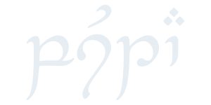

<div align="center">
  <picture>
    <source media="(prefers-color-scheme: dark)" srcset="assets/title-dark.svg">
    <source media="(prefers-color-scheme: light)" srcset="assets/title-light.svg">
    
  </picture>

  <br>

  **pusta** is a comprehensive dotfiles framework focussing on modularity

  <br>

  ---
  
  [Installation](#install) &ensp; • &ensp; [Documentation](../../wiki) &ensp; • &ensp; Example (soon™)  &ensp; • &ensp; [Issues](../../issues)

  ---
</div>

## Concept
Pusta is not your ordinary dotfiles manager - it is rather a comprehensive dotfiles framework. It is designed to streamline the creation, management and installation of your system configuration.

Pusta operates on a modular approach, where each module corresponds to a specific piece of software or system component. A module is a self-contained unit that contains everything needed to install, configure and set up a particular piece of your system. This includes required packages, configuration files, scripts and any other resources.

When installing a module, pusta takes care of the entire installation and setup process, with no manual changes involved anymore. As this simplifies the process of installing and removing components, it makes it easy to reuse and adapt your configuration to different environments and machines. 

## Features
- **Modular Config:** Your configuration consists of many different, independent modules, allowing you to install different parts of your configuration on different systems. 
- **Comprehensive Modules:** In addition to managing configuration files, modules can also install required packages and change system properties, eliminating manual tweaking.
- **Multiple Sources:** Pusta supports multiple sources for modules, making it easy to borrow a part from the configuration of someone else.
- **Dependency System:** Similar to regular packages, modules can have dependencies too, insuring that required software from others modules is installed as needed.
- **Easy Adaptability:** Installing and removing modules is extremely simple, this allows you to change your setup at any time and easily remove unneeded modules with just one command.
- **Clear Format:** Every module is defined in the same manner, making it easy for you and others to expand, maintain and understand your configuration.
- **Variable Templating:** Insert values of variables in all managed files to share common values between modules. Introduce advanced control flow based on them.

## Install
Currently, the only way to install pusta is to compile it from source yourself. To do that, make sure you have the rust toolchain and ```cargo``` installed and clone this repository. Head into the cloned directory and run 
```sh
cargo install
```
to build a release binary and install it on your system. Now, ```pusta``` should be in your path, and you can start using it.

Have a look at the [Getting Started](../../wiki/getting-started) page on the wiki, to get to know pusta. Resources about configuring and using pusta, as well as on structuring your dotfiles, can also be found over there.

## Contributing
You are very welcome to contribute. Refer to the [issues page](../../issues) for more guidance.

## License
This project is licensed under the MIT License. Read more at the [license](LICENSE.txt) file.